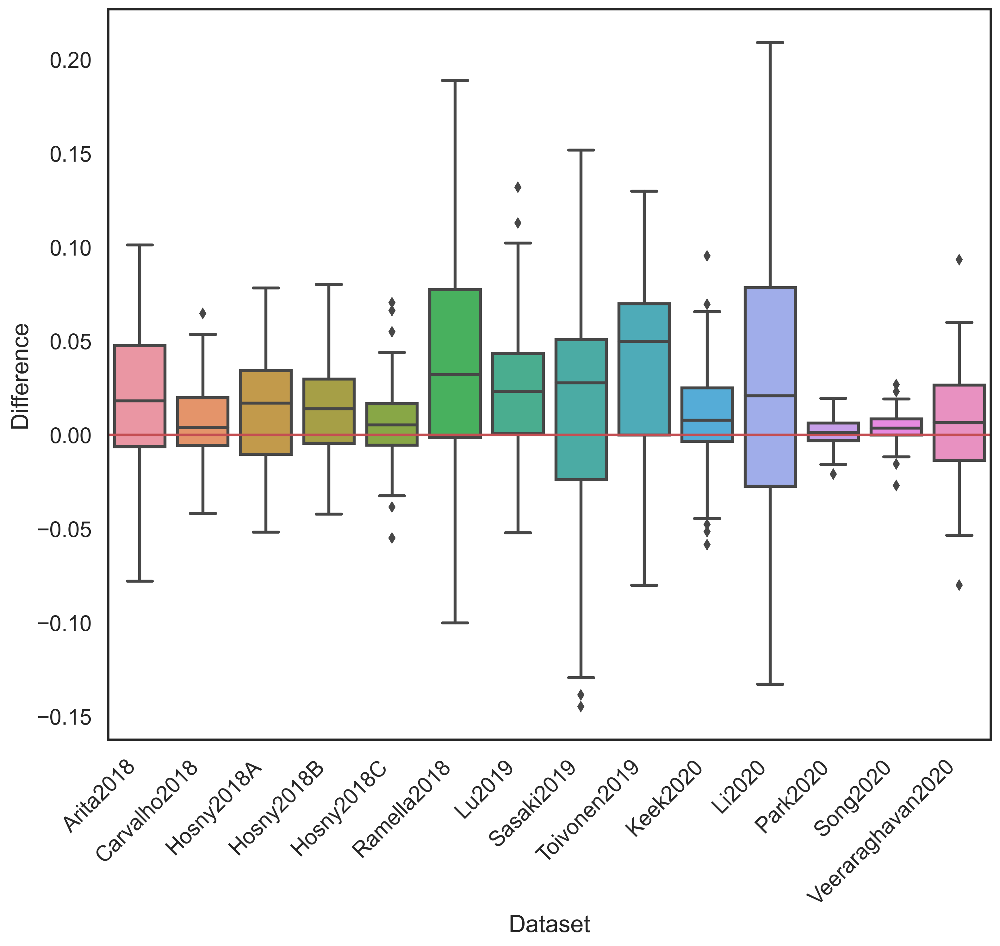

## Comparing two CV schemes

This repository contains the code for comparing nested cross-validation and
the 'select-shuffle-test' method introduced in the well-written review by
Bradshaw et al. (https://pubs.rsna.org/doi/10.1148/ryai.220232).

The select-shuffle-test scheme re-uses the data once for selecting
the best-performing hyperparameters and then for testing their performance.
However, this procedure violates the basic rule that the test set should not
have been used in any way during training, or else the results might be biased.

Accordingly, we have here selected 14 radiomic datasets and compared both
schemes using 3 different feature selection methods and 3 different
classifiers.

As expected, SST provides slightly higher accuracy. Since the
nested cross-validation can be regarded as the gold standard, this
result indicates that the SST is biased. Even though the differences
are slight, care must be taken: First, the differences are significant
when using a simple one-sided t-test. Second, the number of hyper-parameters is
rather slight. Overall, 189 configurations are tested, using only basic feature
selection and (nearly) linear methods. In the radiomic
context, several thousand configurations are often tested with
classifiers that are much more able to overfit the data.
Therefore we expect that the bias will be much larger than computed here.

&nbsp;
&nbsp;

&nbsp;
